# Nostos System Architecture & User Flows

This document outlines the high-level system architecture, smart contract architecture, interaction flows, user interface journeys, data flow, frontend component tree, and security model for the Nostos decentralized RWA Yield Gateway & Settlement Protocol.

## 1. High-Level System Architecture

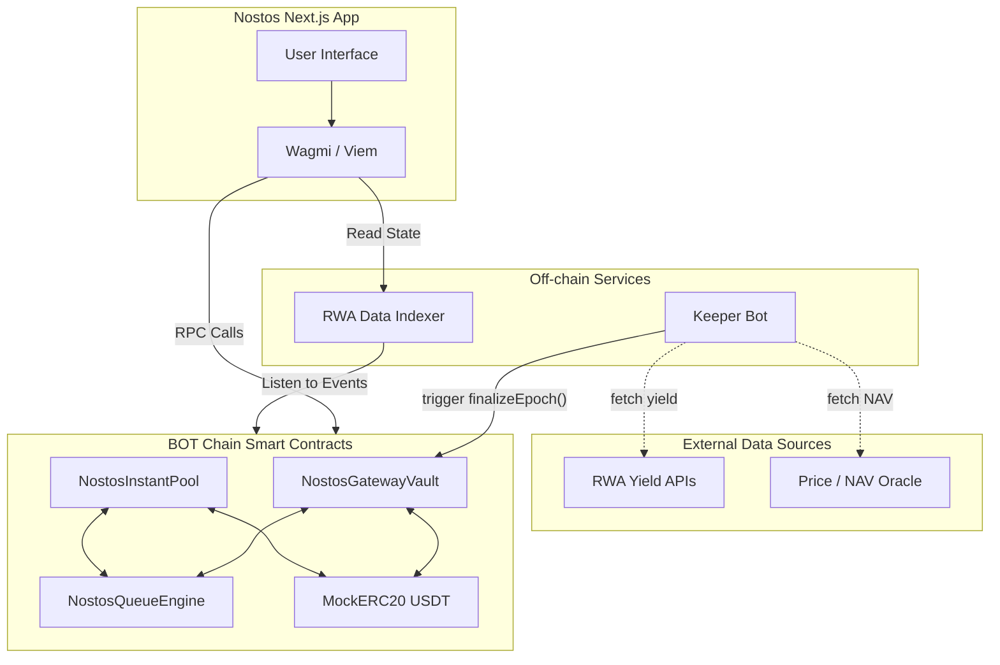

## 2. Smart Contract Architecture

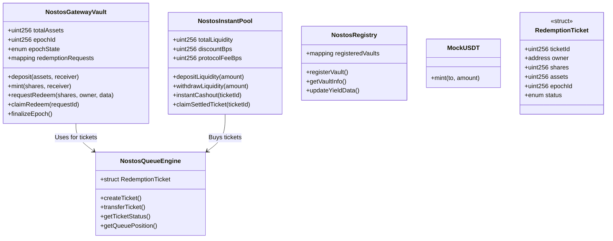

## 3. Contract Interaction Flows

### 3.1 Deposit Flow

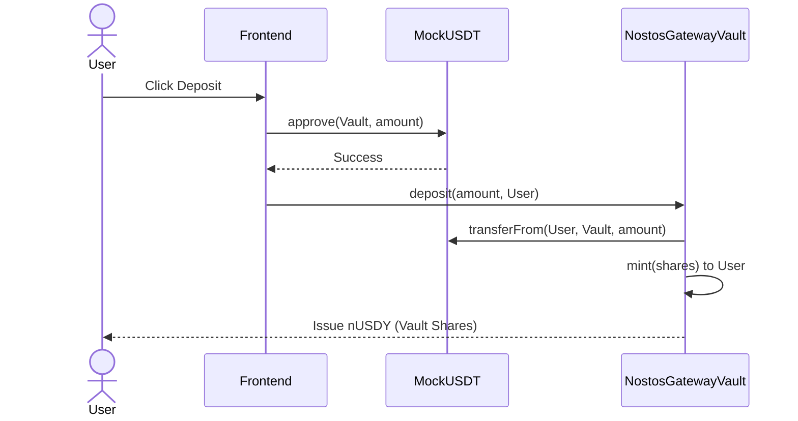

### 3.2 Standard Redemption Flow

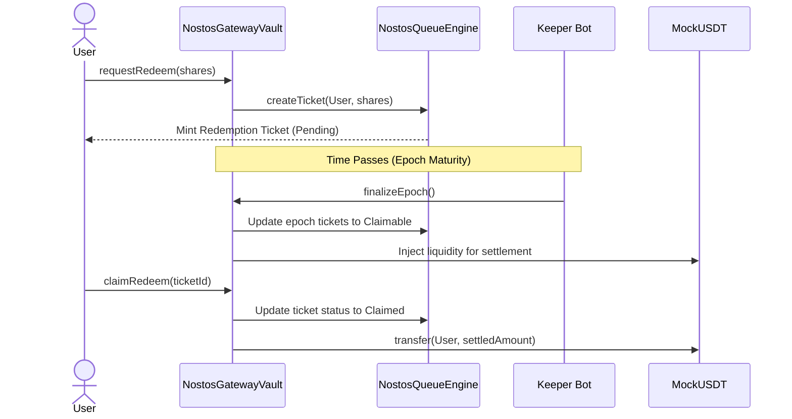

### 3.3 Instant Cashout Flow

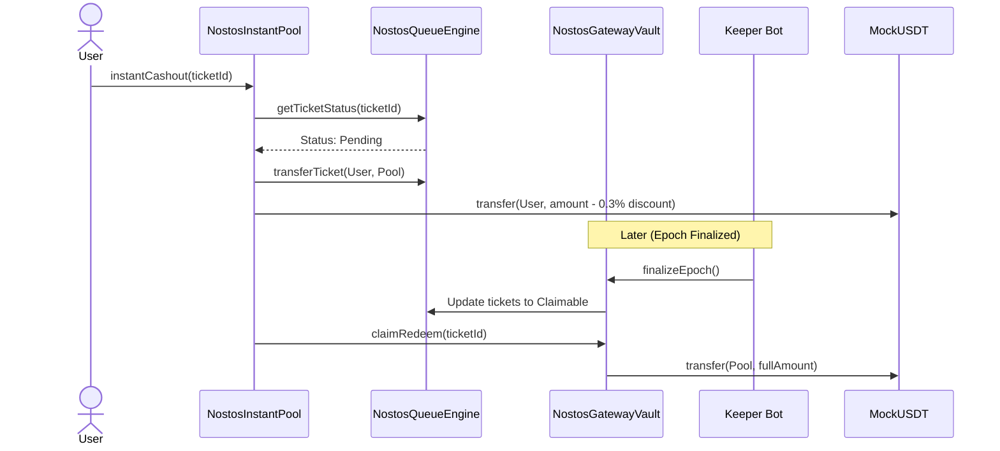

### 3.4 LP Deposit/Withdraw Flow

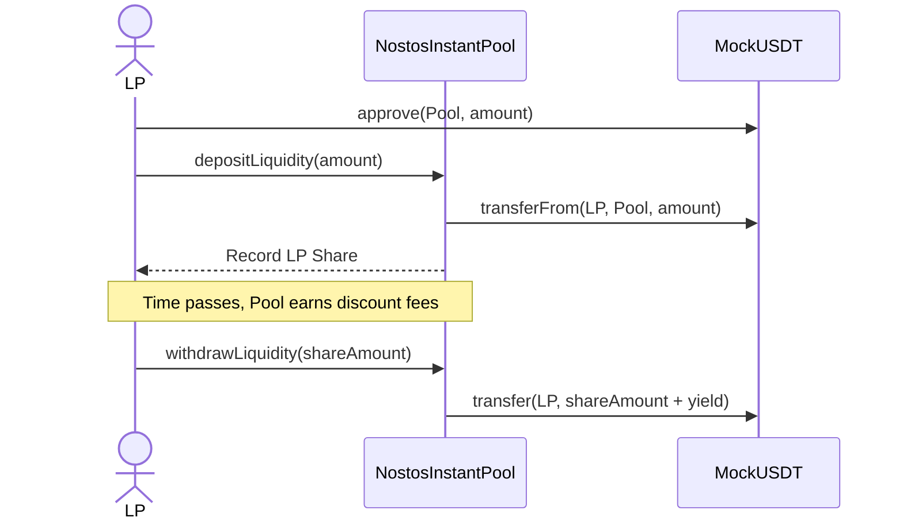

### 3.5 Keeper/Oracle Flow

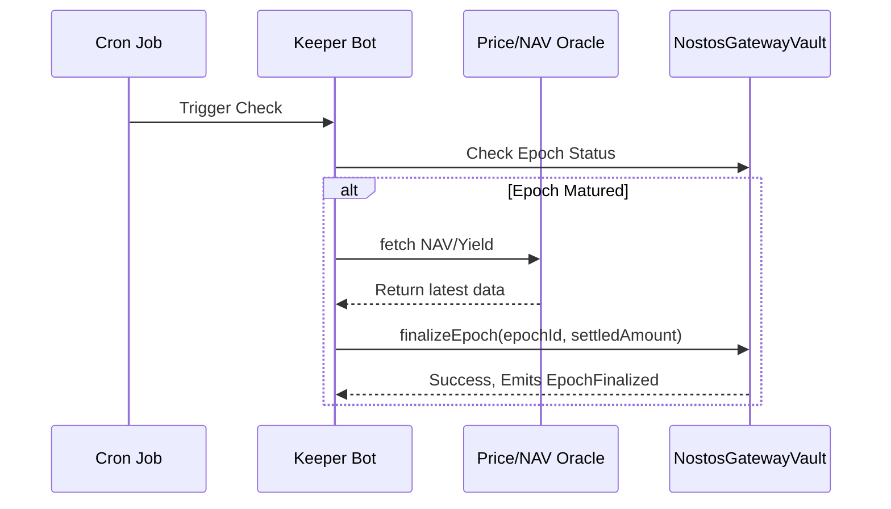

## 4. User Interface Flows

### 4.1 First-Time User Journey

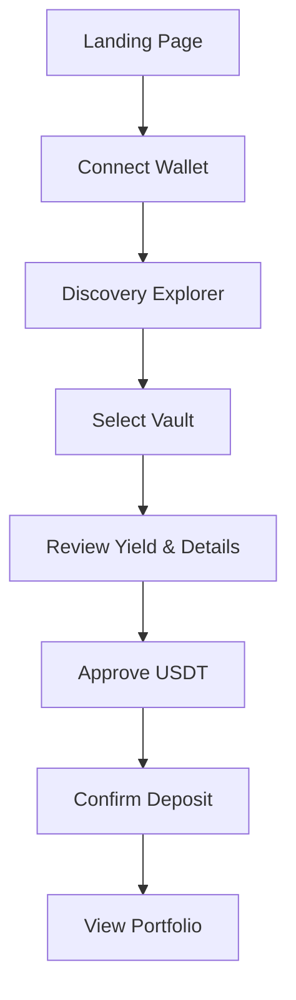

### 4.2 Redemption Journey

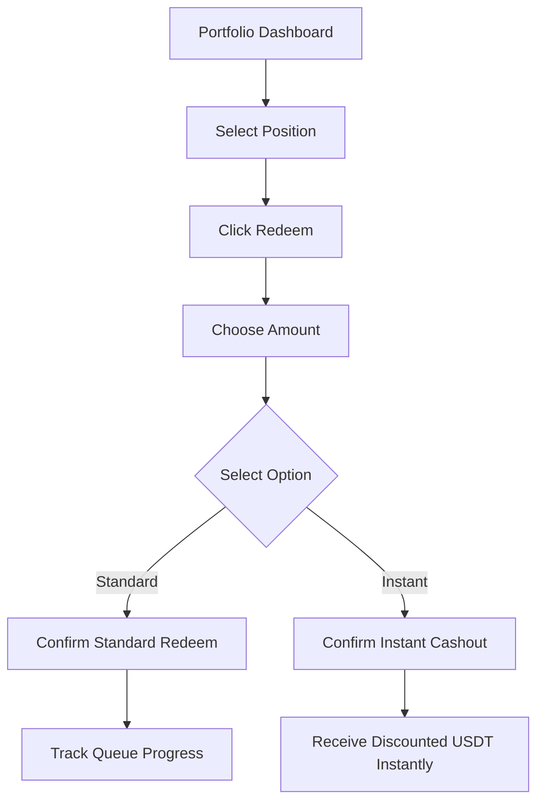

### 4.3 LP Journey

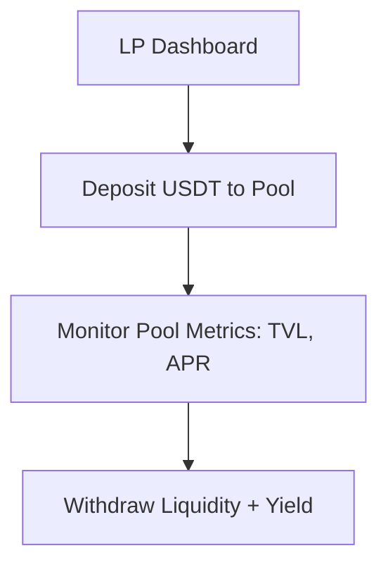

## 5. Data Flow Architecture

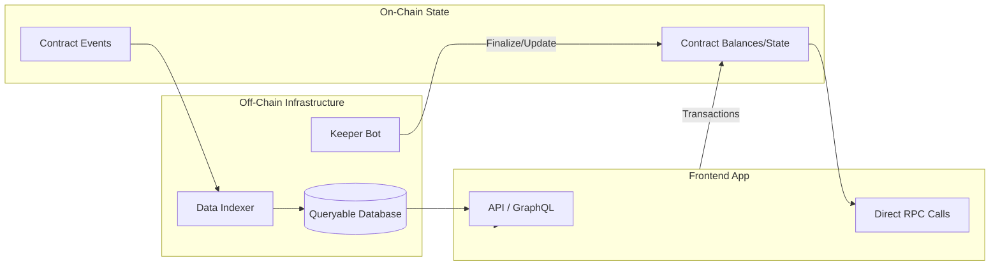

## 6. Frontend Component Architecture

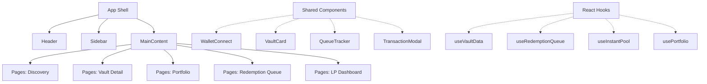

## 7. Security Model

- **Role-based Access Control (RBAC):**
  - **Owner:** Can upgrade contracts, pause/unpause, adjust fees (within limits).
  - **Keeper:** Authorized to call `finalizeEpoch()` and inject settlement liquidity.
  - **User:** Can only interact with their own assets and tickets.

- **Pausable Pattern:**
  - Implemented on `NostosGatewayVault` and `NostosInstantPool` to halt deposits, standard redemptions, and instant cashouts during emergencies.
  - Withdrawal of already settled assets remains active if possible.

- **Reentrancy Guards:**
  - Standard `nonReentrant` modifier applied to all state-changing functions, especially `deposit()`, `claimRedeem()`, `instantCashout()`, and LP functions.

- **Slippage & Parameter Protection:**
  - Hardcoded maximum limits on `discountBps` to prevent governance attacks on LPs/Users.
  - Oracle checks for NAV drops before allowing instant cashout to prevent pool draining on bad debt.
  - Verification that the `ticketId` exists and is `Pending` before processing `instantCashout()`.
